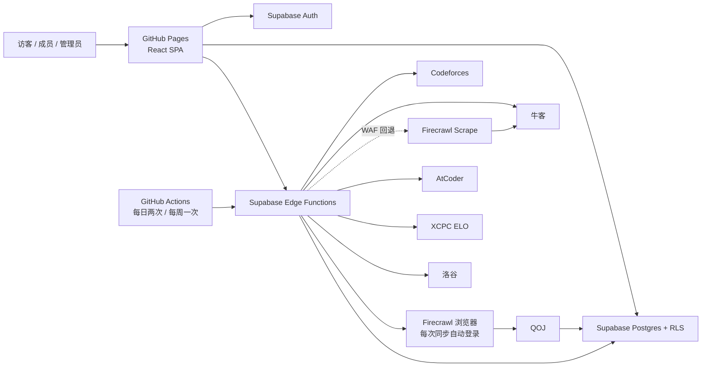

# USTSACMLand

苏州科技大学 ACM 集训队成员数据看板。项目使用 GitHub Pages 托管 React SPA，使用 Supabase 提供认证、Postgres、RLS 和 Edge Functions，集中展示队员在多个竞赛平台的 Rating 与刷题数据。

> 当前状态：生产 Supabase、首管理员、十三份数据库迁移和两个同步函数均已就绪，前端已连接真实认证与管理接口并由 GitHub Pages 发布。QOJ Firecrawl 临时会话自动登录已通过生产烟测。

## 已实现

- Rating 榜：默认总榜，并可切换 Codeforces、牛客、AtCoder、XCPC ELO。
- 刷题榜：默认总榜，并可切换 Codeforces、牛客、AtCoder、洛谷、QOJ。
- 姓名/账号搜索、专业与年级组合筛选、成员列表、成员详情和平台主页链接。
- Supabase 邮箱登录、注册时填写姓名并自动进入资料页、当前密码验证后修改密码、密码重置、资料和平台账号维护；XCPC ELO 根据成员姓名自动匹配。
- 资料页专业联想直接读取根目录 `专业目录.txt`，支持目录匹配与目录外专业自由输入。
- `/account` 登录守卫、`/admin` 管理员角色守卫、会话态导航和退出。
- 后台概览、成员管理与详情、平台绑定维护、手工统计录入、平台账号验证、同步中心、脱敏审计日志和安全 CSV 导出；配置 Supabase 后均使用真实数据。
- 8 张核心表、枚举、约束、索引、触发器、公开视图、RLS 和审计策略。
- `sync-member`、`sync-stats` Edge Functions，支持成员、单平台和平台组同步，并以四成员一批并发编排。
- Codeforces、牛客、AtCoder、XCPC ELO、洛谷真实适配器；QOJ Firecrawl `/interact` 临时会话自动登录适配器和健康检查。
- GitHub Pages 构建/部署、SPA `404.html` 回退和 CI；日更平台每天两次、周更平台每周一次的同步工作流。
- 未配置 Supabase 时，本地开发使用演示数据；生产构建缺少配置时认证功能失败关闭。

Rating 总榜在每个 Rating 平台分别取当前分最高的 5 名成员，并计算其平均值 `X_k`。成员总 Rating 为 `400 × Σ(a_i,k / X_k)`；某平台不足 5 个有效 Rating 时使用全部有效数据，缺失平台贡献 0，显示时保留两位小数。刷题总榜为 CF、牛客、AtCoder、洛谷、QOJ 的已知通过题数之和，并同时展示各平台题数。

## 架构

GitHub Pages 只能托管静态文件，不能保存密码、Cookie 或 API Secret。浏览器只读取 Supabase 中的快照，第三方平台查询全部在服务端完成。



## 技术栈

- React 19、TypeScript、Vite、React Router。
- Supabase Auth、Postgres、RLS、Edge Functions。
- Vitest、Testing Library、ESLint、Prettier。
- GitHub Actions、GitHub Pages。

项目目前没有引入 TanStack Query、React Hook Form、Zod 或仓库级 Playwright 测试。浏览器端数据加载使用 Supabase Client 和 React 状态；端到端视觉 QA 通过 Codex 应用内浏览器执行。

## 数据源状态

| 平台       | 标识         | 指标                           | 当前实现                                                                                                                                   |
| ---------- | ------------ | ------------------------------ | ------------------------------------------------------------------------------------------------------------------------------------------ |
| Codeforces | Handle       | 当前/最高 Rating、唯一 AC 题数 | 已实现官方 `user.info` 和分页 `user.status`，按 `(contestId, index)` 去重；已做真实 smoke test                                             |
| 牛客       | UID          | 当前/最高 Rating、唯一通过题数 | 已实现公开 Rating 历史和练习汇总解析；普通请求遇到 WAF 时自动回退 Firecrawl，使用 12 小时缓存并保留结构化错误                              |
| AtCoder    | Username     | 当前/最高 Rating、唯一 AC 题数 | Rating 使用 `/users/{username}/history/json`，题数使用 AtCoder Problems `user/ac_rank` 的 `count`；区分零 AC 与不存在账号                  |
| XCPC ELO   | 姓名（自动） | 当前/最高 ELO                  | 用户无需填写 ID；注册建立会话后立即按“姓名 + 苏州科技大学”同步，唯一命中时保存稳定 `xcpc_*` ID，同校同名时拒绝自动绑定，缓存策略待完成     |
| 洛谷       | UID          | P/B 题目唯一通过数             | 使用专用凭据请求认证 `/record/list`；首次全量建立题号集合，后续按提交记录 ID 增量读取并定期全量校准；不使用 Firecrawl                      |
| QOJ        | Username     | 唯一 AC 题数                   | 已实现 Firecrawl 每次请求自动登录并读取去重 Accepted problems；失败时记录登录/主页阶段、HTTP 状态或导航异常及 Firecrawl Job ID，不自动重试 |

洛谷统计口径为认证记录接口返回的 Accepted 记录中，PID 以 `P` 或 `B` 开头的题目去重总数，其他前缀不计入。首次同步会读取完整历史并保存私有增量状态；之后从第一页读取到上次成功同步的首条提交记录 ID 即停止，不能用“遇到旧题号”作为边界。记录总数减少、游标异常或距离上次全量同步满 30 天时会自动全量校准。分页间隔为 300ms；达到 `LUOGU_MAX_PAGES` 仍无法确认边界或读完历史时会失败并保留最后一次成功值。

QOJ 统计口径为“去重后的 Accepted 题目数”，不是 Accepted 提交次数。每次同步从 Supabase Function Secrets 读取专用服务账号，先以 `maxAge: 0` 创建全新 Firecrawl scrape 会话，再通过 `/interact` 登录并在同一浏览器中打开目标主页，最后主动结束会话；请求不使用持久 profile，也不读写 Firecrawl 页面缓存。账号密码不会进入前端、源码、Git、统计日志或错误信息，但会作为 Firecrawl interact 作业请求的一部分发送给 Firecrawl，因此只能使用可独立轮换的专用账号。

## 同步计划

- 新用户注册后立即进入资料页，不需要成员审核；资料完整后自动进入公开成员范围。
- 注册建立会话后立即触发本人 XCPC ELO 自动匹配，启动失败会自动重试一次；服务端只在注册后的短时间窗口内放行，并以唯一索引保证每名成员只能消费一次 registration 同步，不能借此手动重放或同步其他平台。
- 平台账号被管理员标记为已验证后，立即同步该平台。单平台任务按“成员 + 平台”独立去重，不同平台并发验证不会互相丢任务；验证结果先保存，首次同步失败不会撤销验证状态。
- Codeforces、牛客、洛谷、AtCoder：北京时间每天 07:00 和 19:00 更新。
- XCPC ELO、QOJ：北京时间每周二 08:00 更新。

数据新鲜度与计划批次对齐：日更平台在下一个 07:00/19:00 批次之后保留 2 小时执行宽限，周更平台在下一个周二 08:00 批次之后保留 24 小时执行宽限。只有宽限结束仍没有新的成功结果才显示“已过期”；宽限期内的手动、平台验证或重试同步失败会记录错误，但不会把仍有效的数据提前标记过期。榜单时间显示最近成功时间。GitHub Actions 的定时任务是 best-effort，繁忙时可能比标称时间略晚启动；管理员仍可在同步中心手动触发。

参考项目：[FCYXSZY/astrbot_plugin_acm_helper](https://github.com/FCYXSZY/astrbot_plugin_acm_helper)。本项目借鉴其 Codeforces 分页/Accepted 去重思路，以及 `luogu_api/ckp.py` 的洛谷 Cookie、CSRF 和记录列表请求方式；凭据改由 Supabase Secrets 管理，不进入源码。

## 数据模型

迁移文件 [supabase/migrations/202607120001_initial_schema.sql](./supabase/migrations/202607120001_initial_schema.sql) 已创建：

| 表                  | 用途                                           |
| ------------------- | ---------------------------------------------- |
| `profiles`          | 姓名、QQ、年级、专业、角色、启用状态和公开设置 |
| `platform_accounts` | 平台账号、标准化 ID、验证状态和唯一绑定        |
| `platform_stats`    | 最新 Rating、最高 Rating、刷题数、新鲜度和错误 |
| `stat_snapshots`    | 历史统计快照                                   |
| `sync_jobs`         | 同步任务、重试、冷却和去重信息                 |
| `sync_runs`         | 单平台运行结果、耗时、错误码和源版本           |
| `announcements`     | 公告                                           |
| `audit_logs`        | 平台验证、角色、绑定和同步等敏感操作审计       |

十三份数据库迁移定义生产项目 `qzggoqdmsvktrtnjislw` 的当前结构；新 profile 必须从注册 metadata 写入姓名并自动启用，历史待审核/已驳回成员会自动迁移为启用，已停用成员保持停用。公开视图只返回姓名、年级和专业均完整且选择公开的成员。成员年级由 `profiles.grade` 维护；XCPC ELO 账号行由 Profile 姓名触发器创建和失效，普通成员不能直接写入、修改或删除。成员管理 RPC 仅允许正常管理员读取私有目录与详情、编辑资料、维护非 XCPC 平台绑定、停用/恢复成员和手工录入统计，并使用行锁与更新时间乐观锁防止并发误操作。手工统计会原子创建成功运行记录、当前统计、历史快照和审计日志，来源标记为 `admin-manual/v1`，下一次成功自动同步会覆盖。生产 Schema 类型已生成到 `src/types/database.ts` 并接入 Supabase Client，完整的多身份 RLS 测试矩阵仍待完成。

## 页面

- `/`：重定向到 `/rankings`。
- `/rankings`：Rating 榜和刷题榜。
- `/members`、`/members/:id`：成员列表与详情。
- `/privacy`：公开数据范围、第三方处理方和资料删除说明。
- `/login`、`/register`、`/forgot-password`：认证流程。
- `/account`：当前用户资料、平台绑定和密码修改；XCPC ELO 显示姓名自动匹配状态，不提供 ID 输入框。普通成员不能手动同步，数据由计划任务和管理员更新。
- `/admin`：成员账号、已验证平台账号、失败任务和数据新鲜度概览。
- `/admin/members`：成员私有目录、关键词/状态筛选、编辑资料、停用和恢复；不包含成员审批。
- `/admin/members/:id`：成员详情、平台账号新增/修改/验证/同步/解绑、手工统计录入和最近活动。
- `/admin/accounts`：平台绑定验证、无效原因、停用和重新验证，使用更新时间乐观锁防止误审旧 UID；XCPC ELO 仅展示服务端自动匹配结果。
- `/admin/sync`：真实运行记录、近 7 天数据源健康度、全量同步确认和失败重试。
- `/admin/audit`：脱敏审计日志和防公式注入 CSV 导出。

后台路由已经做前端管理员守卫，数据库仍以 RLS、最小表权限和管理员 RPC 作为真正安全边界。平台账号验证使用乐观锁防止基于旧页面误审；验证后的首次同步独立执行，同步失败不会回滚验证状态。统计、快照和同步表仅允许管理员读取，由 service role 写入。普通成员调用同步函数会被服务端拒绝；管理员手动与平台账号验证触发的同步均通过 Edge Function 鉴权，并写入脱敏审计记录。

### 首管理员初始化

首次部署时，先让管理员账号完成注册并在 `/account` 填写姓名、QQ、年级和专业。随后在 Supabase SQL Editor 中以数据库管理员身份执行一次：

```sql
select public.bootstrap_first_admin('admin@example.edu.cn');
```

该函数只允许 `service_role` 或 Supabase SQL 管理员调用，并且在已有管理员后永久拒绝再次引导。生产项目已完成首管理员初始化。不要把 service role key 放入浏览器环境变量或前端代码；后续管理员角色管理仍待后台功能实现。

## 快速开始

要求 Node.js 22 或更高版本。

```bash
npm ci
npm run dev
```

本地访问 `http://127.0.0.1:5173/`。仓库内被忽略的 `.env.development.local` 已连接生产 Supabase，测试环境不会读取该配置；删除该文件后，开发服务器会回到演示数据和演示认证模式。

常用检查：

```bash
npm run format:check
npm run lint
npm test
npm run build
npx --yes deno check --config supabase/functions/deno.json supabase/functions/sync-member/index.ts supabase/functions/sync-stats/index.ts
npx --yes deno lint --config supabase/functions/deno.json supabase/functions
npx --yes deno test --allow-read --config supabase/functions/deno.json supabase/functions
```

## 环境变量与 Secrets

公开浏览器变量：

- `VITE_SUPABASE_URL`
- `VITE_SUPABASE_ANON_KEY`

GitHub Actions Secrets：

- `SUPABASE_PROJECT_REF`
- `SUPABASE_SERVICE_ROLE_KEY`
- `VITE_SUPABASE_URL`
- `VITE_SUPABASE_ANON_KEY`

Supabase Function Secrets/配置：

- `FIRECRAWL_API_KEY`（牛客 WAF 回退及 QOJ 自动登录，只能配置在 Supabase Secrets）
- `QOJ_SERVICE_USERNAME`（专用 QOJ 服务账号）
- `QOJ_SERVICE_PASSWORD`（专用 QOJ 服务账号密码）
- `LUOGU_COOKIE`（专用洛谷会话 Cookie）
- `LUOGU_CSRF_TOKEN`（与 Cookie 对应的 CSRF Token）
- `ALLOWED_ORIGIN`
- 可选：`FIRECRAWL_API_URL`、`CODEFORCES_MAX_PAGES`、`LUOGU_MAX_PAGES`、`XCPC_ELO_DATA_URL`

`service_role`、第三方服务凭据和其他敏感信息不得使用 `VITE_*` 前缀，也不得进入 Git 历史。`ALLOWED_ORIGIN` 支持逗号分隔的 Origin 白名单，例如 `http://localhost:5173,http://127.0.0.1:5173,https://greenthree.github.io`；Origin 不包含 `/USTSACMLand/` 路径。

洛谷 Cookie 与 CSRF Token 必须来自独立、可轮换的服务账号，并且保持成对更新。`LUOGU_MAX_PAGES` 默认 100、最大 1000；它只用于阻止异常分页无限消耗请求，不应调低到无法覆盖成员完整提交历史。

### QOJ 自动登录

`QOJ_SERVICE_USERNAME` 和 `QOJ_SERVICE_PASSWORD` 只配置在 Supabase Function Secrets。适配器每次创建不使用缓存的临时 Firecrawl 浏览器，通过 `/interact` 填写 QOJ 登录表单、确认 `Logout` 登录态、读取目标用户主页，并在 `finally` 中请求结束会话。不要把真实值写入 `.env.example`、命令历史、CI 日志或截图。

在受控环境中注入三项 Secret 后，可使用任一公开 QOJ 用户名做完整登录健康检查：

```bash
npx --yes deno run \
  --allow-env=FIRECRAWL_API_KEY,FIRECRAWL_API_URL,QOJ_SERVICE_USERNAME,QOJ_SERVICE_PASSWORD \
  --allow-net --config supabase/functions/deno.json \
  scripts/check-qoj-login.ts <public-QOJ-username>
```

当前 Firecrawl 账户未开通 Zero Data Retention，作业请求可能由 Firecrawl 按其策略保留。该账号必须与任何个人账号和其他系统密码完全隔离；轮换密码时同时更新 Supabase Secret，并重新运行健康检查。

## 部署

生产 Supabase 项目已关联并应用十三份迁移，`sync-member` 与 `sync-stats` 已部署为 ACTIVE。函数部署需要显式传入 Deno import map：

```bash
npx --yes supabase@latest db push --linked --include-all
npx --yes supabase@latest functions deploy sync-member sync-stats \
  --use-api --import-map supabase/functions/deno.json
```

Vite 生产 `base` 已设置为 `/USTSACMLand/`，构建脚本会复制 `dist/index.html` 为 `dist/404.html`，`.github/workflows/deploy-pages.yml` 负责测试、构建和 Pages 发布。正式地址约定为 `https://greenthree.github.io/USTSACMLand/`；Supabase Auth 回调配置保留 localhost 并加入正式路径，`ALLOWED_ORIGIN` 则使用不含路径的 `https://greenthree.github.io`。

## 当前限制与下一步

1. 增加 QOJ 登录失败告警和 Firecrawl 用量监控。
2. 增加平台账号自动验证和真正的原子队列、重试与冷却控制。
3. 完成多身份 RLS/越权集成测试和管理员角色管理。
4. 验证生产邮箱确认、密码重置、会话恢复和管理员登录完整流程。
5. 增加同步失败通知、XCPC 数据缓存和更完整的重试/退避策略。

视觉规范见 [docs/DESIGN.md](./docs/DESIGN.md)，详细进度见 [ROADMAP.md](./ROADMAP.md)。

## 许可证与归属

许可证尚未确定；在补充 `LICENSE` 前，源码默认不授予复制、修改或再分发许可。数据处理说明见 [PRIVACY.md](./PRIVACY.md)，漏洞报告方式见 [SECURITY.md](./SECURITY.md)。正式使用学校及 ACM 集训队相关标识前仍需确认授权范围。
