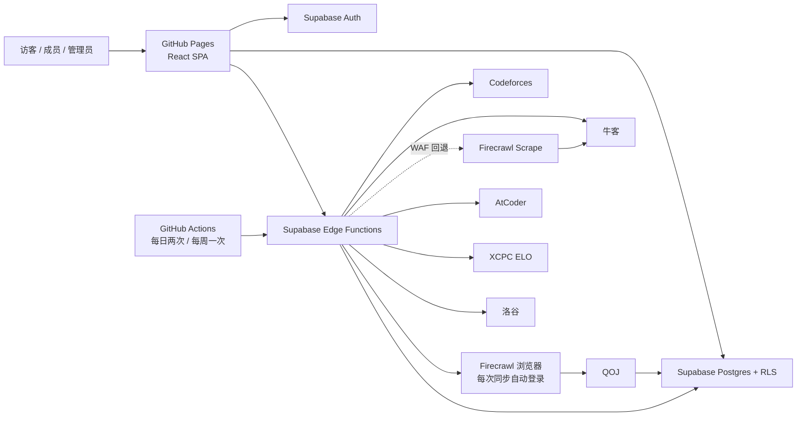

# USTSACMLand

苏州科技大学 ACM 集训队官网。项目使用 GitHub Pages 托管 React SPA，介绍算法竞赛、主要赛事、线上公开赛、学习资源和入队方式，并通过 Supabase 提供认证、Postgres、RLS 和 Edge Functions，展示队员在多个竞赛平台的 Rating 与刷题数据。

> 当前状态：集训队官网首页、生产 Supabase、首管理员和同步函数均已就绪，前端已连接真实认证与管理接口并由 GitHub Pages 发布。最新的 XCPC 共享缓存、快照幂等、平台账号规范化、账号删除生命周期、持久同步队列、后台队列进度、公告管理、管理员限流、AtCoder 手工题数、洛谷快照幂等、非洛谷原子提交/小数 Rating、XCPC 手工小数 Rating、受控管理员交接及管理员删除终点守卫 migration 尚待 CI 空库验证与生产部署。自助注销函数也尚未部署；QOJ Firecrawl 临时会话自动登录已通过生产烟测。仓库已加入 Dependabot、Gitleaks 和发布检查单，仍需推送后验证真实工作流并配置 `main` 保护规则。

## 已实现

- 集训队官网首页：介绍 ACM 赛制、主要高校赛事、线上公开赛、学习资源、公开训练记录和年度入队比赛。
- Rating 榜：默认总榜，可切换 Codeforces、牛客、AtCoder、XCPC ELO，显示各平台等级色与文字标签，并支持分页和键盘切换。
- 刷题榜：默认总榜，可切换 Codeforces、牛客、AtCoder、洛谷、QOJ，并支持分页。
- 姓名/账号搜索、专业与年级组合筛选、成员列表、成员详情、平台主页链接，以及按 Codeforces、牛客、AtCoder、XCPC ELO 切换的真实 Rating 历史趋势。
- Supabase 邮箱登录、注册时填写姓名并自动进入资料页、当前密码验证后修改密码、密码重置、普通成员密码复核与二次确认后自助注销、资料和平台账号维护；XCPC ELO 根据成员姓名自动匹配。
- 平台绑定在保存前校验 CF、AtCoder、QOJ 用户名和牛客、洛谷数字 UID；重复绑定仅提示账号已占用，不泄露其他成员身份。
- 资料页专业联想直接读取根目录 `专业目录.txt`，支持目录匹配与目录外专业自由输入。
- `/account` 登录守卫、`/admin` 管理员角色守卫、会话态导航和退出。
- 后台概览、成员管理与详情、当前筛选成员 CSV 导出、平台绑定维护、手工统计录入、平台账号验证、公告管理、同步中心、独立数据源健康页和脱敏审计日志 CSV 导出；配置 Supabase 后均使用真实数据。
- 8 张核心业务表、2 张 XCPC ELO 私有缓存表、1 张注销恢复下限私有租约表、枚举、约束、索引、触发器、公开视图、RLS 和审计策略。
- `sync-member`、`sync-stats`、`change-password` 和 `delete-account` Edge Functions；同步入口支持成员、单平台、平台组和到期队列同步，改密与注销均在服务端复核当前密码，改密成功后全局撤销刷新会话并退出本设备，注销入口只允许当前普通成员删除本人，并由数据库最终守卫拒绝活动同步或当前管理员。
- Codeforces、牛客、AtCoder、XCPC ELO、洛谷真实适配器；QOJ Firecrawl `/interact` 临时会话自动登录适配器和健康检查。
- 六个平台均保存最小脱敏固定样本，并通过统一成功/失败结果契约测试；样本清单见 [`testdata/README.md`](./supabase/functions/_shared/adapters/testdata/README.md)。
- GitHub Pages 构建/部署、SPA `404.html` 回退和 CI；日更平台每天两次、周更平台每周一次的同步工作流；Dependabot 周更与完整历史 Gitleaks 门禁。
- Chromium、Firefox、WebKit、390px 移动 Chromium 与 1920px 宽屏 Chromium 的 Playwright 深链、键盘、登录返回、后台对话框、XCPC 小数手工录入、页面级横向溢出和 axe WCAG A/AA 门禁。
- 公开成员、平台账号和当前统计按稳定游标完整分页读取；任一页失败或必填字段异常时整批拒绝，不把截断或半份真实数据混入榜单。
- 页面和后台模块按路由懒加载；登录、注册、隐私、账号和后台路由不再无条件读取公开榜单数据。
- 未配置 Supabase 时，本地开发使用演示数据；生产构建缺少配置时认证功能失败关闭。

Rating 总榜在每个 Rating 平台分别取当前分最高的 5 名成员，并计算其平均值 `X_k`。成员总 Rating 为 `400 × Σ(a_i,k / X_k)`；总历史最高 Rating 使用相同公式，但成员分数和平台前五平均值均改用历史最高 Rating。某平台不足 5 个有效 Rating 时使用全部有效数据，缺失平台贡献 0，两项总 Rating 均保留两位小数。刷题总榜为 CF、牛客、AtCoder、洛谷、QOJ 的已知通过题数之和，并同时展示各平台题数。

## 架构

GitHub Pages 只能托管静态文件，不能保存密码、Cookie 或 API Secret。浏览器只读取 Supabase 中的快照，第三方平台查询全部在服务端完成。



关键取舍和安全边界见 [架构决策记录](./docs/adr/README.md)，外部平台字段与处理边界见 [第三方数据来源说明](./docs/third-party-data-sources.md)。

## 技术栈

- React 19、TypeScript、Vite、React Router。
- Supabase Auth、Postgres、RLS、Edge Functions。
- Vitest、Testing Library、Playwright、axe、Deno test、ESLint、Prettier。
- GitHub Actions、GitHub Pages。

项目目前没有引入 TanStack Query、React Hook Form 或 Zod。浏览器端数据加载使用 Supabase Client 和 React 状态；仓库级 Playwright 覆盖 Chromium、Firefox、WebKit、移动端与 1920px 宽屏，并以 axe 检查页面级可访问性。部署后另有只读生产榜单复算门禁。

## 数据源状态

| 平台       | 标识         | 指标                           | 当前实现                                                                                                                                                |
| ---------- | ------------ | ------------------------------ | ------------------------------------------------------------------------------------------------------------------------------------------------------- |
| Codeforces | Handle       | 当前/最高 Rating、唯一 AC 题数 | 已实现官方 `user.info` 和分页 `user.status`，跨页按稳定题目标识去重；后续页失败、页数截断或响应结构漂移时拒绝部分统计；已做真实 smoke test              |
| 牛客       | UID          | 当前/最高 Rating、唯一通过题数 | 已实现公开 Rating 历史和练习汇总解析；普通请求遇到 WAF 时自动回退 Firecrawl，使用 12 小时缓存并保留结构化错误                                           |
| AtCoder    | Username     | 当前/最高 Rating、唯一 AC 题数 | Rating 使用 `/users/{username}/history/json`，题数使用 AtCoder Problems `user/ac_rank` 的 `count`；区分零 AC 与不存在账号，并拒绝畸形或乱序 Rating 历史 |
| XCPC ELO   | 姓名（自动） | 当前/最高 ELO                  | 用户无需填写 ID；注册后按“姓名 + 苏州科技大学”唯一匹配；使用数据库共享缓存、刷新租约与 ETag/Last-Modified 条件请求，同校同名时拒绝绑定                  |
| 洛谷       | UID          | P/B 题目唯一通过数             | 使用专用凭据请求认证 `/record/list`；首次全量建立题号集合，后续按提交记录 ID 增量读取并定期全量校准；不使用 Firecrawl                                   |
| QOJ        | Username     | 唯一 AC 题数                   | 已实现 Firecrawl 每次请求自动登录并读取去重 Accepted problems；失败时记录登录/主页阶段、HTTP 状态或导航异常及 Firecrawl Job ID，不自动重试              |

洛谷统计口径为认证记录接口返回的 Accepted 记录中，PID 以 `P` 或 `B` 开头的题目去重总数，其他前缀不计入。首次同步会读取完整历史并保存私有增量状态；之后从第一页读取到上次成功同步的首条提交记录 ID 即停止，不能用“遇到旧题号”作为边界。记录总数减少、游标异常或距离上次全量同步满 30 天时会自动全量校准。分页间隔为 300ms；达到 `LUOGU_MAX_PAGES` 仍无法确认边界或读完历史时会失败并保留最后一次成功值。

QOJ 统计口径为“去重后的 Accepted 题目数”，不是 Accepted 提交次数。每次同步从 Supabase Function Secrets 读取专用服务账号，先以 `maxAge: 0` 创建全新 Firecrawl scrape 会话，再通过 `/interact` 登录并在同一浏览器中打开目标主页，最后主动结束会话；请求不使用持久 profile，也不读写 Firecrawl 页面缓存。账号密码不会进入前端、源码、Git、统计日志或错误信息，但会作为 Firecrawl interact 作业请求的一部分发送给 Firecrawl，因此只能使用可独立轮换的专用账号。

XCPC ELO 上游 `data.js` 约 20 MB。同步服务只在数据库缓存过期后由一个持有租约的 Edge Function 下载，并只保存“苏州科技大学”选手的精简版本化记录；其他并发请求等待同一版本发布。上游支持 `304 Not Modified` 时只续期缓存。网络、限流、超大响应或结构变化会记录共享冷却并返回失败，旧榜单统计仍保留，但不会把旧缓存冒充为本次成功或刷新 `last_success_at`。历史最高 ELO 从真实比赛 `history` 计算，不采用官网字段中的人工初始 1500 分。

## 同步计划

- 新用户注册后立即进入资料页，不需要成员审核；资料完整后自动进入公开成员范围。
- 注册建立会话后立即触发本人 XCPC ELO 自动匹配，启动失败会自动重试一次；服务端只在注册后的短时间窗口内放行，并以唯一索引保证每名成员只能消费一次 registration 同步，不能借此手动重放或同步其他平台。
- 平台账号被管理员标记为已验证后，立即同步该平台。单平台任务按“成员 + 平台”独立去重，不同平台并发验证不会互相丢任务；验证结果先保存，首次同步失败不会撤销验证状态。
- Codeforces、牛客、洛谷、AtCoder：北京时间每天 07:00 和 19:00 更新。
- XCPC ELO、QOJ：北京时间每周二 08:00 更新。

数据新鲜度与计划批次对齐：日更平台在下一个 07:00/19:00 批次之后保留 2 小时执行宽限，周更平台在下一个周二 08:00 批次之后保留 24 小时执行宽限。只有宽限结束仍没有新的成功结果才显示“已过期”；宽限期内的手动、平台验证或重试同步失败会记录错误，但不会把仍有效的数据提前标记过期。榜单时间显示最近成功时间。GitHub Actions 的定时任务是 best-effort，繁忙时可能比标称时间略晚启动；管理员仍可在同步中心手动触发。

单平台临时故障使用持久 `sync_jobs` 队列，普通平台最多执行 3 次，失败后分别等待 2 分钟和 4 分钟；每 5 分钟的服务任务使用数据库 `SKIP LOCKED` 原子领取到期任务，并回收超过 15 分钟未结束的 Worker。QOJ 不自动重试，避免重复创建 Firecrawl 会话或加重风控；GitHub Actions 只发送一次同步 POST，由静态检查阻止重新加入 `curl` 传输层重试。批量同步会拆成单平台任务：Codeforces/AtCoder 并发 2，XCPC ELO 并发 4，牛客/洛谷/QOJ 并发 1。

参考项目：[FCYXSZY/astrbot_plugin_acm_helper](https://github.com/FCYXSZY/astrbot_plugin_acm_helper)。本项目借鉴其 Codeforces 分页/Accepted 去重思路，以及 `luogu_api/ckp.py` 的洛谷 Cookie、CSRF 和记录列表请求方式；凭据改由 Supabase Secrets 管理，不进入源码。

## 数据模型

迁移文件 [supabase/migrations/202607120001_initial_schema.sql](./supabase/migrations/202607120001_initial_schema.sql) 已创建：

| 表                       | 用途                                           |
| ------------------------ | ---------------------------------------------- |
| `profiles`               | 姓名、QQ、年级、专业、角色、启用状态和公开设置 |
| `platform_accounts`      | 平台账号、标准化 ID、验证状态和唯一绑定        |
| `platform_stats`         | 最新 Rating、最高 Rating、刷题数、新鲜度和错误 |
| `stat_snapshots`         | 历史统计快照                                   |
| `sync_jobs`              | 同步任务、重试、冷却和去重信息                 |
| `sync_runs`              | 单平台运行结果、耗时、错误码和源版本           |
| `announcements`          | 公告                                           |
| `audit_logs`             | 平台验证、角色、绑定和同步等敏感操作审计       |
| `xcpc_elo_cache_state`   | XCPC ELO 活跃版本、条件请求元数据、租约与冷却  |
| `xcpc_elo_cache_players` | 我校选手的版本化精简 XCPC ELO 缓存             |

按时间排序的数据库迁移定义仓库目标结构；新 profile 必须从注册 metadata 写入姓名并自动启用，历史待审核/已驳回成员会自动迁移为启用，已停用成员保持停用。公开视图只返回姓名、年级和专业均完整且选择公开的成员。成员年级由 `profiles.grade` 维护；XCPC ELO 账号行由 Profile 姓名触发器创建和失效，普通成员不能直接写入、修改或删除。成员管理 RPC 仅允许正常管理员读取私有目录与详情、编辑资料、维护非 XCPC 平台绑定、停用/恢复成员和手工录入统计，并使用行锁、更新时间乐观锁和原子限流防止并发误操作与重复滥用。公告表撤销浏览器直写权限，管理员通过带行锁和严格递增版本时间戳的 RPC 新建、发布、归档或删除公告；公开视图仍只返回已到发布时间且尚未过期的已发布公告，所有写操作继续由触发器审计。平台账号只有在适配器确认存在后才会标记为已验证并写入首次统计；CF 使用上游返回的规范 Handle，牛客和洛谷 UID 去除前导零，活动同步期间禁止并发改号或解绑。普通成员注销后 Auth、资料、平台绑定、统计和同步记录级联删除，相关审计记录在同一数据库事务内移除全部个人标识。完整策略见 [账号与数据生命周期](./docs/data-lifecycle.md)。手工统计会原子创建成功运行记录、当前统计、历史快照和审计日志，来源标记为 `admin-manual/v1`，AtCoder 同时允许 Rating 与题数，XCPC ELO 手工 Rating 保留至多两位小数，下一次成功自动同步会覆盖。带上游观测时间的成功快照由唯一索引保证幂等，失败运行不冒充新的源观测；洛谷使用专用原子纠正 RPC，其他平台使用通用原子 RPC，在同一事务中锁定并复核成员仍为启用、账号与运行记录仍可写，再更新当前统计、写入幂等快照并关闭 run，避免停用后提交或公开半提交数据。XCPC ELO 当前分、历史最高分和共享缓存使用两位小数存储，不再隐式丢失官网精度。成员趋势只读取公开视图中的 `fresh` Rating 快照，四个平台分别限额查询并按非空上游观测时间去重，横轴使用真实观测时间比例；失败快照不会伪装成新的 Rating 节点。生产 Schema 类型已生成到 `src/types/database.ts` 并接入 Supabase Client，XCPC 服务端缓存表与 RPC 也受 CI 类型存在性门禁保护；同步中心支持全体、指定成员和指定平台三种管理员触发范围，并在执行前确认影响范围。数据库身份矩阵、XCPC 缓存租约、快照幂等、平台账号规范化、删除生命周期、持久队列、后台队列进度、公告管理、管理员限流、手工统计平台矩阵、洛谷幂等序列和非洛谷原子提交测试已加入 CI，仍需首次空库容器运行通过后验收。

## 页面

- `/`：集训队官网首页，包含 ACM 介绍、赛事版图、线上公开赛、学习资源、训练记录和加入方式。
- `/rankings`：Rating 榜和刷题榜。
- `/members`、`/members/:id`：成员列表与详情；详情页展示平台主页、当前统计，以及四个 Rating 平台的真实历史快照、摘要和可访问明细。
- `/privacy`：公开数据范围、第三方处理方和资料删除说明。
- `/login`、`/register`、`/forgot-password`、`/reset-password`：登录、注册、发送重置邮件和恢复链接设置新密码流程。
- `/account`：当前用户资料、平台绑定和密码修改；XCPC ELO 显示姓名自动匹配状态，不提供 ID 输入框。普通成员不能手动同步，数据由计划任务和管理员更新。
- `/admin`：成员账号、已验证平台账号、失败任务和数据新鲜度概览。
- `/admin/members`：成员私有目录、关键词/状态筛选、当前结果 CSV 导出、编辑资料、停用和恢复；不包含成员审批。
- `/admin/members/:id`：成员详情、平台账号新增/修改/验证/同步/解绑、手工统计录入和最近活动。
- `/admin/accounts`：平台绑定验证、无效原因、停用和重新验证，使用更新时间乐观锁防止误审旧 UID；XCPC ELO 仅展示服务端自动匹配结果。
- `/admin/announcements`：公告草稿、发布、定时发布、过期、归档、游标分页、乐观锁编辑和审计删除。
- `/admin/sync`：活动队列进度、真实运行记录、全体/成员/平台范围同步确认和失败重试。
- `/admin/health`：24 小时、7 天或 30 天窗口内的六平台成功率、耗时、最近故障、凭据异常和无样本状态。
- `/admin/audit`：脱敏审计日志和防公式注入 CSV 导出。

后台路由已经做前端管理员守卫，数据库仍以 RLS、最小表权限和管理员 RPC 作为真正安全边界。平台账号验证使用乐观锁防止基于旧页面误审；验证后的首次同步独立执行，同步失败不会回滚验证状态。统计、快照和同步表仅允许管理员读取，由 service role 写入。普通成员调用同步函数会被服务端拒绝；管理员手动与平台账号验证触发的同步均通过 Edge Function 鉴权，并写入脱敏审计记录。

### 首管理员初始化

首次部署时，先让管理员账号完成注册并在 `/account` 填写姓名、QQ、年级和专业。随后在 Supabase SQL Editor 中以数据库管理员身份执行一次：

```sql
select public.bootstrap_first_admin('admin@example.edu.cn');
```

该函数只允许 `service_role` 或 Supabase SQL 管理员调用，并且在已有管理员后永久拒绝再次引导。生产项目已完成首管理员初始化。不要把 service role key 放入浏览器环境变量或前端代码；后续交接在后台成员管理中完成，提升或降级必须填写原因、确认权限影响、通过乐观锁与速率限制，并由数据库保证始终保留至少一名启用管理员。

## 快速开始

要求 Node.js 22 或更高版本。

```bash
npm ci
npm run dev
```

本地访问 `http://127.0.0.1:5173/`。如需连接 Supabase，可在被 Git 忽略的 `.env.development.local` 中配置 `VITE_SUPABASE_URL` 与 `VITE_SUPABASE_ANON_KEY`；测试环境不会读取该文件。未配置时，开发服务器使用明确标注的演示数据和演示认证模式，生产构建则不会启用演示认证。

常用检查：

```bash
npm run format:check
npm run lint
npm run check:sync-workflow
npm test
npx playwright install chromium firefox webkit
npm run test:e2e
npm run build
npm run check:bundle
npx --yes deno check --config supabase/functions/deno.json supabase/functions/sync-member/index.ts supabase/functions/sync-stats/index.ts supabase/functions/delete-account/index.ts supabase/functions/change-password/index.ts
npx --yes deno lint --config supabase/functions/deno.json supabase/functions
npx --yes deno test --allow-read --allow-env --config supabase/functions/deno.json supabase/functions
npm run test:db
```

`npm run test:e2e:production` 是部署后的只读榜单复算门禁，需要在环境中提供 `PRODUCTION_E2E_BASE_URL`、`VITE_SUPABASE_URL` 和 `VITE_SUPABASE_ANON_KEY`。它只读取公开视图，拒绝演示数据回退，并独立复算全部公开成员在总榜和各平台榜的排序、总 Rating、总历史最高 Rating 与总题数；Pages workflow 会在新版本部署完成后自动执行。

生产构建还会自动执行 bundle budget：入口 JS 必须不超过 500 KiB 原始体积和 160 KiB gzip，并保留首页、榜单、登录、账号、后台概览和同步中心的独立路由块。`npm run check:bundle` 可在已有 `dist` 上单独复核。

数据库安全测试需要 Docker。它会从空的本地 Supabase 实例应用全部迁移，再以匿名访客、成员、停用成员和管理员身份验证 RLS、列权限、XCPC ELO 写保护、统计表只读边界与受控管理员 RPC；清单驱动矩阵会自动对照全部 27 个 `admin_*` 函数，保证 19 个浏览器入口对普通/停用成员统一拒绝，8 个 `_unlimited` 实现不向浏览器角色开放。CI 在独立任务中执行同一套测试。

## 环境变量与 Secrets

公开浏览器变量：

- `VITE_SUPABASE_URL`
- `VITE_SUPABASE_ANON_KEY`

只读生产验收变量：

- `PRODUCTION_E2E_BASE_URL`（正式 Pages 根路径，不进入前端构建）

GitHub Actions Secrets：

- `SUPABASE_PROJECT_REF`
- `SUPABASE_SERVICE_ROLE_KEY`
- `VITE_SUPABASE_URL`
- `VITE_SUPABASE_ANON_KEY`
- `SUPABASE_DB_URL`（仅供加密数据库备份，使用 Session pooler URI）
- `BACKUP_ENCRYPTION_PASSPHRASE`（独立随机口令，至少 32 个字符）

Supabase Function Secrets/配置：

- `FIRECRAWL_API_KEY`（牛客 WAF 回退及 QOJ 自动登录，只能配置在 Supabase Secrets）
- `QOJ_SERVICE_USERNAME`（专用 QOJ 服务账号）
- `QOJ_SERVICE_PASSWORD`（专用 QOJ 服务账号密码）
- `LUOGU_COOKIE`（专用洛谷会话 Cookie）
- `LUOGU_CSRF_TOKEN`（与 Cookie 对应的 CSRF Token）
- 可选：`SYNC_ALERT_WEBHOOK_URL`（仅 HTTPS）、`SYNC_ALERT_WEBHOOK_TOKEN`
- `DELETION_RECOVERY_REPOSITORY`、`DELETION_RECOVERY_GITHUB_TOKEN`（注销前更新 GitHub 恢复下限；Token 仅授予目标仓库 Variables write）
- `ALLOWED_ORIGIN`
- 可选：`FIRECRAWL_API_URL`、`CODEFORCES_MAX_PAGES`、`LUOGU_MAX_PAGES`、`XCPC_ELO_DATA_URL`
- 可选 XCPC 缓存调优：`XCPC_ELO_CACHE_TTL_SECONDS`、`XCPC_ELO_CACHE_LEASE_SECONDS`、`XCPC_ELO_CACHE_RETRY_SECONDS`、`XCPC_ELO_CACHE_WAIT_MS`、`XCPC_ELO_CACHE_POLL_MS`、`XCPC_ELO_MAX_SOURCE_BYTES`、`XCPC_ELO_MIN_SOURCE_PLAYERS`

`service_role`、第三方服务凭据和其他敏感信息不得使用 `VITE_*` 前缀，也不得进入 Git 历史。`ALLOWED_ORIGIN` 支持逗号分隔的 Origin 白名单，例如 `http://localhost:5173,http://127.0.0.1:5173,https://greenthree.github.io`；Origin 不包含 `/USTSACMLand/` 路径。

永久注销采用“禁止恢复到注销前”的恢复下限策略。`delete-account` 的目标绑定数据库租约覆盖完整临界区：取得 `owner + target_user_id` 租约 → 将一个不含用户 ID、姓名、邮箱或账号的 UTC 时间写入 GitHub 仓库变量 `BACKUP_RECOVERY_NOT_BEFORE` 并回读确认 → 续期并停止外部阶段心跳 → 调用仅限 service role 的最终 RPC。RPC 先锁定租约单例行和目标 Profile，再次验证 owner、target、有效期、普通成员角色和无活动同步，设置事务内 fence 标记，并在同一事务删除 `auth.users` 与消费租约；Auth 删除触发器拒绝任何没有匹配 owner/target 标记的旧 HTTP 或旁路删除，因此部署切换期间的旧 Edge 请求也会失败关闭。Auth/Profile 级联和审计匿名化只会整体提交或回滚。租约冲突、取得或删除前续期失败，或恢复下限写入与确认失败时，函数不执行 Auth 删除并返回 `503`；管理员、活动同步、Storage 所有权或其他受控约束拒绝删除时返回 `409`，账号与业务数据保持不变。数据库行锁使最终删除不再依赖 Edge Runtime 定时心跳：即使租约墙钟到期，竞争请求也只能等待首个删除事务结束。备份会记录当时的下限，恢复前还必须用仓库变量当前值执行 `npm run verify:backup-recovery-floor -- <metadata.txt>`。

仓库提供每日加密逻辑备份工作流：分别导出角色、应用 Schema、业务数据、Auth 用户数据和 migration 历史，只上传 AES-256 加密密文并保留 14 天。Supabase Free 项目没有自动每日备份保障；付费套餐的实际备份窗口仍须在 Dashboard 核对。配置、恢复演练和 Storage 限制见 [数据库备份与恢复方案](./docs/backup-and-recovery.md)。

终态同步失败、Firecrawl 低额度和四个 Edge Function 的非业务型 500 可发送脱敏 Webhook。运行时通知只包含固定函数名、固定错误类别、时间和安全格式的请求 ID，不发送异常 message/stack、成员身份、请求体或第三方响应；通知失败不会改变原业务结果。浏览器端不保存告警 Token，只提供顶层错误边界和脱敏本地运行时事件。配置与验收方式见 [运行时与同步告警](./docs/sync-alerting.md)。

洛谷 Cookie 与 CSRF Token 必须来自独立、可轮换的服务账号，并且保持成对更新。`LUOGU_MAX_PAGES` 默认 100、最大 1000；它只用于阻止异常分页无限消耗请求，不应调低到无法覆盖成员完整提交历史。

### QOJ 自动登录

`QOJ_SERVICE_USERNAME` 和 `QOJ_SERVICE_PASSWORD` 只配置在 Supabase Function Secrets。适配器每次创建不使用缓存的临时 Firecrawl 浏览器，通过 `/interact` 填写 QOJ 登录表单、确认 `Logout` 登录态、读取目标用户主页，并在 `finally` 中请求结束会话。不要把真实值写入 `.env.example`、命令历史、CI 日志或截图。

在受控环境中注入三项 Secret 后，可使用任一公开 QOJ 用户名做完整登录健康检查：

```bash
npx --yes deno run \
  --allow-env=FIRECRAWL_API_KEY,FIRECRAWL_API_URL,QOJ_SERVICE_USERNAME,QOJ_SERVICE_PASSWORD \
  --allow-net --config supabase/functions/deno.json \
  scripts/check-qoj-login.ts <public-QOJ-username>
```

当前 Firecrawl 账户未开通 Zero Data Retention，作业请求可能由 Firecrawl 按其策略保留。该账号必须与任何个人账号和其他系统密码完全隔离；轮换密码时同时更新 Supabase Secret，并重新运行健康检查。

## 部署

生产 Supabase 项目已关联，`sync-member`、`sync-stats`、`delete-account` 与 `change-password` 均已部署为 ACTIVE。仓库 migration 必须按时间顺序应用；部署前先使用 `supabase migration list --linked` 核对远端状态，再应用尚未部署的 migration。函数部署需要显式传入 Deno import map：

`202607140010_platform_account_canonicalization.sql` 会在修改数据前检查历史牛客/洛谷绑定：如果两个成员的 UID 只差前导零，或存在超过 20 位的旧 UID，migration 会带修复提示安全终止。管理员应先在成员管理中确认归属并改正或解绑冲突记录，再重新应用 migration；脚本不会自动选择账号所有者或删除成员数据。

```bash
npm run check:supabase-preflight
npx --yes supabase@2.109.1 db push --linked --include-all
npx --yes supabase@2.109.1 functions deploy sync-member sync-stats delete-account change-password \
  --use-api --import-map supabase/functions/deno.json
npm run check:supabase-readiness
```

Vite 生产 `base` 已设置为 `/USTSACMLand/`，构建脚本会复制 `dist/index.html` 为 `dist/404.html`。`.github/workflows/deploy-pages.yml` 仅在 `main` 的完整 CI 成功后运行，并检出通过 CI 的精确提交再构建、发布 Pages；数据库安全任务失败不会覆盖线上版本。正式地址约定为 `https://greenthree.github.io/USTSACMLand/`；Supabase Auth 回调配置保留 localhost 并加入正式路径，`ALLOWED_ORIGIN` 则使用不含路径的 `https://greenthree.github.io`。

## 当前限制与下一步

1. 配置生产同步失败 Webhook，并增加 Firecrawl 用量监控。
2. 让持久队列 migration 与 pgTAP 首次通过 CI，并完成生产队列恢复烟测。
3. 让包含匿名访问、唯一冲突、停用提交回滚、管理员交接和全部管理员 RPC 授权矩阵的多身份 pgTAP 首次通过空库 CI。
4. 验证生产邮箱确认、密码重置、会话恢复和管理员登录完整流程。
5. 让 XCPC 共享缓存 migration 与 pgTAP 首次通过 CI/生产烟测，并完成告警投递烟测。
6. 按 [GitHub 仓库保护设置](./docs/repository-settings.md) 启用 `main` ruleset、原生 Secret scanning，并验证 Dependabot/Gitleaks 首次运行。
7. 选择源码许可证，小范围试运行后按 [正式发布检查单](./docs/release-checklist.md) 准备 `v1.0.0`。

视觉规范见 [docs/DESIGN.md](./docs/DESIGN.md)，架构取舍见 [docs/adr/](./docs/adr/README.md)，部署与故障处理见 [生产运维手册](./docs/operations-runbook.md)，数据恢复见 [数据库备份与恢复方案](./docs/backup-and-recovery.md)，发布门禁见 [正式发布检查单](./docs/release-checklist.md)，详细进度见 [ROADMAP.md](./ROADMAP.md)。

## 许可证与归属

许可证尚未确定；在补充 `LICENSE` 前，源码默认不授予复制、修改或再分发许可。数据处理说明见 [PRIVACY.md](./PRIVACY.md) 与 [第三方数据来源说明](./docs/third-party-data-sources.md)，漏洞报告方式见 [SECURITY.md](./SECURITY.md)。正式使用学校及 ACM 集训队相关标识前仍需确认授权范围。
