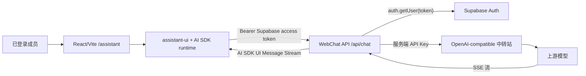

# WebChat 与 assistant-ui 接入路线图

> 研究基线：2026-07-16。本文是实施计划，不代表功能已经上线。assistant-ui 与 AI SDK 更新较快，开始开发时必须重新核对 npm 版本、官方迁移说明和中转站协议。

## 1. 目标与结论

目标是在现有 USTSACMLand React/Vite SPA 中增加一个仅登录用户可用的 AI 学习助手，并满足以下边界：

- 使用 assistant-ui 提供聊天组件、消息状态、流式交互、停止生成和可访问性基础能力。
- 复用现有 Supabase Auth 会话，不建立第二套账号系统。
- 通过服务端 `/api/chat` 调用 OpenAI-compatible 中转站；中转站密钥绝不进入 Vite 前端。
- 第一版只做文字聊天，不做文件上传、联网搜索、MCP、前端工具调用或长期记忆。
- 保持现有 GitHub Pages 静态前端可构建；聊天 API 必须部署在单独的动态运行环境。
- 将 Chat 页面继续按路由懒加载，不能显著增加首页、榜单和登录页的首屏包体积。

结论：assistant-ui 可以用于本项目，但它只负责 UI 和客户端 runtime。推荐的完整链路是：



## 2. 当前项目约束

### 2.1 已有基础

- React 19、TypeScript、Vite、React Router。
- GitHub Pages 只托管静态文件，不能安全保存中转站密钥，也不能实现 `/api/chat`。
- Supabase Auth 已启用会话持久化、自动刷新 Token 和路由登录守卫。
- 页面使用 `React.lazy` 分包，CI 通过 `scripts/check-bundle-size.mjs` 检查入口包预算。
- UI 使用单一的 `src/styles.css` 和自有组件，没有 Tailwind CSS、shadcn/ui 或 `components.json`。
- 已有 Edge Function 的 Bearer Token、CORS、错误监控和可测试 handler 模式可供参考。
- 已有 Playwright 多浏览器、移动端、宽屏和 axe 可访问性门禁。

### 2.2 直接照搬官方 starter 不可行

assistant-ui 的快速开始主要展示 Next.js API Route 和 shadcn/Tailwind 组件。本项目是 Vite SPA，因此：

- 不能创建 `app/api/chat/route.ts` 后期望 GitHub Pages 执行它。
- 不应在第一阶段运行 `npx assistant-ui init` 后无审查地接受其对样式、别名和组件树的修改。
- 不应为了一个 Chat 页面把整个项目迁移到 Next.js。
- 不应在第一阶段引入 Tailwind；优先使用 assistant-ui primitives，并按现有 CSS 体系实现页面。
- 不应把 `RELAY_API_KEY`、`RELAY_BASE_URL` 或服务端模型配置加上 `VITE_` 前缀。

## 3. 研究结论与技术选择

### 3.1 assistant-ui 的职责

assistant-ui 官方架构把能力分成 UI、runtime、后端/agent、协议和持久化。它不会替项目托管模型密钥，也不会自动把任意中转站响应变成安全的生产 API。

本项目使用：

- `@assistant-ui/react`：Thread、Message、Composer、ActionBar 等组件和 runtime provider。
- `@assistant-ui/react-ai-sdk`：把 Vercel AI SDK 的 `useChat` 接入 assistant-ui runtime。
- `@assistant-ui/react-markdown`：渲染 Markdown；必须保持原始 HTML 禁用并约束外链。
- AI SDK UI Message Stream：浏览器与 `/api/chat` 的流式协议。
- `@ai-sdk/openai-compatible`：服务端连接 OpenAI-compatible 中转站。

### 3.2 推荐 runtime

第一版选择 AI SDK runtime，而不是直接对中转站写自定义 `fetch` 解析器，原因是：

- assistant-ui 官方将 AI SDK列为常规文本流式聊天的默认集成。
- `useChat`/transport 已覆盖请求、取消、错误和流式消息状态。
- 服务端可以用 `streamText` 把中转站 SSE 转成 UI Message Stream。
- 后续增加工具调用、Token 元数据或持久化时不需要重新设计基础协议。

若中转站与 OpenAI streaming 协议不兼容，应在 Phase 0 停止实施 AI SDK 路径，转而评估 `LocalRuntime` + 自定义 `ChatModelAdapter`；不能靠字符串替换勉强解析未知 SSE。

### 3.3 UI 形态

MVP 使用受保护的完整页面 `/assistant`，暂不使用全站悬浮 `AssistantModal`：

- 完整页面在移动端、键盘操作、长代码块和错误展示方面更可靠。
- Chat 依赖只在访问该路由时下载。
- 不遮挡现有移动导航、页脚和后台对话框。
- 后续确认交互稳定后，再评估桌面端悬浮入口；移动端仍跳转完整页面。

### 3.4 历史记录

MVP 只保存当前标签页中的运行时消息，刷新页面后清空。这样可以先验证真实使用价值，同时避免立即新增敏感对话存储、RLS、删除和数据保留规则。

长期历史记录放到后续阶段，使用自建 Supabase 表和 assistant-ui history/thread adapters；不依赖 Assistant Cloud。

## 4. 版本兼容前置门禁

2026-07-16 查询到的 npm 状态如下，仅作为 spike 基线：

| 包                             | 查询版本                                               | 备注                                                                     |
| ------------------------------ | ------------------------------------------------------ | ------------------------------------------------------------------------ |
| `@assistant-ui/react`          | `0.14.26`                                              | 支持 React 18/19                                                         |
| `@assistant-ui/react-ai-sdk`   | `1.3.40`                                               | 当前发布包直接依赖 `ai ^6.0.209` 与 `@ai-sdk/react ^3.0.211`             |
| `@assistant-ui/react-markdown` | `0.14.5`                                               | peer 需要 `@assistant-ui/react ^0.14.18`                                 |
| `ai`                           | `7.0.29` 最新；`6.0.228` 为 v6 当前版本                | assistant-ui 文档推荐新项目使用 v7，但当前 npm adapter 的直接依赖仍为 v6 |
| `@ai-sdk/react`                | `4.0.32` 最新；`3.0.230` 为 v3 当前版本                | v3 接受项目当前 lockfile 中的 React `19.2.7`                             |
| `@ai-sdk/openai-compatible`    | `3.0.11` 最新；`2.0.61` 与 AI SDK v6 provider ABI 对齐 | 不能跨主要版本混装                                                       |
| `react` / `react-dom`          | manifest 为 `^19.1.1`，lockfile/已安装为 `19.2.7`      | 当前已满足 assistant-ui 与 AI SDK v3 的 peer 范围                        |

这里存在明确的版本错位风险：官方文档已把 AI SDK v7 标成 current，但 npm 上 `@assistant-ui/react-ai-sdk@1.3.40` 仍直接安装 AI SDK v6 依赖。实施时必须先做一个独立依赖 spike，禁止直接安装所有 `latest`。

建议先验证这套稳定候选矩阵：

```text
@assistant-ui/react            0.14.x
@assistant-ui/react-ai-sdk     1.3.x
@assistant-ui/react-markdown   0.14.x
ai                             6.0.x
@ai-sdk/react                  3.0.x
@ai-sdk/openai-compatible      2.0.x
zod                            4.x
react/react-dom                19.2.x
```

只有在 npm adapter 明确支持并且最小样例验证通过时，才切换到 AI SDK v7。Spike 必须保存 `package-lock.json` 并检查：

```powershell
npm ls react react-dom ai @ai-sdk/react @ai-sdk/provider @assistant-ui/react @assistant-ui/react-ai-sdk
npm run lint
npm test
npm run build
```

通过条件：不存在重复的 AI SDK 主版本、peer dependency warning、类型冲突或入口包预算回归。

## 5. 推荐 API 契约

### 5.1 浏览器请求

```http
POST /api/chat
Authorization: Bearer <Supabase access token>
Content-Type: application/json
X-Request-ID: <uuid>
```

请求体使用所选 AI SDK 版本的 `UIMessage[]` 契约。前端 transport 每次发送前动态读取 Supabase Session，不能在 runtime 创建时永久捕获可能过期的 Token。

前端配置目标形态：

```ts
new DefaultChatTransport({
  api: chatApiUrl,
  headers: async () => {
    const session = await getCurrentSupabaseSession()
    return session ? { Authorization: `Bearer ${session.access_token}` } : {}
  },
})
```

以上为契约示意；实际 API 名称必须以 Phase 0 锁定版本的类型定义为准。

### 5.2 服务端响应

- 成功：`200`，AI SDK UI Message Stream/SSE。
- 未登录或 Token 失效：`401`。
- 账号停用或没有使用资格：`403`。
- 请求体、消息数或文本长度超限：`400`/`413`。
- 用户速率或每日额度耗尽：`429`，附 `Retry-After`。
- 中转站拒绝请求：按规则映射为 `502`，不透传中转站内部信息。
- 上游超时：`504`。
- 服务未配置或紧急关闭：`503`。

必须支持 Abort：用户点击“停止生成”或断开页面时，中止对中转站的上游请求，避免继续计费。

### 5.3 CORS

如果 Chat API 与网站同域，使用相对地址 `/api/chat`，不需要浏览器跨域配置，这是最终推荐形态。

如果 GitHub Pages 调用独立 API 域名，则只允许明确 Origin：

```text
https://greenthree.github.io
http://localhost:5173
http://127.0.0.1:5173
```

不能使用反射任意 Origin，也不能在携带凭据时返回 `Access-Control-Allow-Origin: *`。

## 6. 服务端安全边界

### 6.1 身份验证

独立 Node/Deno 服务收到 Bearer Token 后应调用 Supabase `auth.getUser(token)`，或使用 Supabase JWKS 做严格签名校验。不要复用 `_shared/jwt.ts` 中仅解码 payload 的辅助函数；该函数只适用于已经由 Supabase Gateway 验证过 JWT 的 Edge Function 内部路径。

认证后还要确认：

- `profiles.id` 与 Auth user 一致。
- 账号处于启用状态。
- 必要时只允许普通成员和管理员，不允许匿名访问。
- 数据库查询失败时失败关闭，不能把未知状态当作有权限。

### 6.2 中转站配置

仅允许服务端环境变量：

```env
CHAT_RELAY_BASE_URL=https://relay.example.com/v1
CHAT_RELAY_API_KEY=
CHAT_RELAY_MODEL=
CHAT_SYSTEM_PROMPT_VERSION=usts-learning-assistant-v1
CHAT_ALLOWED_ORIGINS=https://greenthree.github.io
CHAT_MAX_REQUEST_BYTES=262144
CHAT_MAX_MESSAGES=40
CHAT_MAX_TOTAL_CHARS=60000
CHAT_MAX_OUTPUT_TOKENS=2048
CHAT_REQUEST_TIMEOUT_MS=120000
CHAT_ENABLED=false
```

禁止出现：

```text
VITE_CHAT_RELAY_API_KEY
VITE_OPENAI_API_KEY
前端可传入的 baseURL
前端可任意选择的模型 ID
前端可覆盖的 system prompt
```

服务端 provider 的目标形态：

```ts
const relay = createOpenAICompatible({
  name: 'usts-relay',
  apiKey: env.CHAT_RELAY_API_KEY,
  baseURL: env.CHAT_RELAY_BASE_URL,
  includeUsage: true,
})

const model = relay.chatModel(env.CHAT_RELAY_MODEL)
```

`baseURL` 是否包含 `/v1`、模型 ID、Usage 字段和 SSE 格式必须通过中转站真实烟测确定。

### 6.3 请求约束

MVP 应在调用上游前执行：

- 只接受 `POST` 和 `OPTIONS`。
- 限制 Content-Type、请求体大小、消息数量、单条长度和总字符数。
- 仅接受 `user`/`assistant` 的文字 part；拒绝未知附件、URL、工具调用和客户端 system message。
- 服务端注入固定 system prompt。
- 限制温度、最大输出和超时；客户端参数不直接透传。
- 每用户最多 1 个活动生成请求。
- 每用户每分钟建议不超过 5 次；每日额度由预算倒推，不写死在前端。
- 对同一个客户端请求 ID 做短期幂等/去重，降低重复点击和网络重试造成的双重计费。

### 6.4 日志与隐私

默认日志只记录：

- request ID、匿名化 user ID、状态码。
- 模型 ID、开始时间、首 Token 延迟、总耗时。
- 输入/输出 Token 数和估算费用。
- 中转站请求 ID、超时、限流或协议错误代码。

默认不记录完整 Prompt、模型完整回复、Supabase JWT 或中转站 Key。上线前需要更新隐私说明，明确用户消息会发送给中转站及其上游模型，并确认中转站的数据保留、训练使用和删除政策。

## 7. 前端改造计划

建议目录：

```text
src/
├─ features/
│  └─ chat/
│     ├─ ChatPage.tsx
│     ├─ ChatRuntimeProvider.tsx
│     ├─ ChatThread.tsx
│     ├─ ChatMessage.tsx
│     ├─ ChatComposer.tsx
│     ├─ ChatEmptyState.tsx
│     ├─ chatApi.ts
│     ├─ chatErrors.ts
│     └─ *.test.tsx
└─ styles.css
```

需要完成：

- 在 `src/App.tsx` 中懒加载 `/assistant`。
- 用现有 `RequireAuth` 包裹路由。
- 只对已登录用户在 `AppShell` 显示“AI 助手”导航。
- runtime provider 只包裹 Chat 页面，不能提升到整个 App 根节点。
- 从 Supabase Session 动态构建 Authorization Header。
- 使用项目现有 CSS 变量、间距、按钮和焦点样式，不整体引入 Tailwind。
- 中文空状态给出 3–4 个学习型建议 Prompt，例如算法讲解、代码调试和训练复盘。
- 支持发送、流式显示、停止、重试、复制和清空当前会话。
- 对 401 显示重新登录入口；对 429 显示可理解的剩余额度/重试时间；对 502/504 保留用户消息以便重试。
- Markdown 禁止原始 HTML；外链使用 `target="_blank"`、`rel="noreferrer noopener"`，代码块支持横向滚动。
- Chat 路由加入 bundle chunk 检查，确认首页入口仍在现有预算内。

MVP 暂不实现：

- 文件、图片、PDF 上传。
- 语音输入/输出。
- 模型选择器。
- 多会话侧栏和服务器历史。
- 工具调用、MCP、网页搜索。
- 展示模型隐藏推理过程。

## 8. 后端部署选择

### 8.1 推荐生产形态：独立 WebChat API

```text
浏览器 -> https://api.example.com/api/chat -> 中转站
```

或在统一入口反向代理成同域：

```text
https://rank.example.com/api/chat -> 本地/HK Node API
```

优点：

- 可以选择大陆访问质量较好的香港线路或国内服务器。
- 不受 GitHub Pages 静态能力限制。
- 可以稳定控制 SSE、超时、连接断开、限流和日志。
- 将来前端迁移对象存储/CDN 时无需修改 Chat 协议。

若使用内网穿透，本地服务必须保持在线，公网入口要支持 HTTPS 与 SSE；它适合小范围试运行，不应被描述为高可用生产环境。

### 8.2 最快验证形态：Supabase Edge Function

可以新增 `supabase/functions/webchat`，复用现有 handler、CORS、`auth.getUser` 和错误监控模式。中转站 Key 保存为 Function Secret。

优点是没有新增服务器，缺点是大陆用户仍需访问 Supabase，不能解决之前讨论的网络稳定性问题。因此它只适合协议 Spike 或临时 MVP，不作为“大陆稳定访问”的最终架构。

### 8.3 实施顺序建议

1. 先用本地 API mock 验证 assistant-ui 与 UI Message Stream。
2. 再连接真实中转站并完成协议烟测。
3. 小范围试运行可选 Supabase Edge Function 或本地穿透。
4. 稳定上线时切换到香港/国内 API 域名，前端只改 `VITE_CHAT_API_URL`。

## 9. 可选数据库设计

MVP 不保存对话正文，但建议从第一天记录原子额度数据。后续 migration 可拆为两步。

### 9.1 用量与限流

建议私有表：

```text
chat_usage_daily
  user_id
  usage_date
  request_count
  input_tokens
  output_tokens
  estimated_cost_microunits
  updated_at
```

配套安全函数：

- `claim_chat_quota(user_id, request_id, limits...)`：行锁下原子占用次数/并发额度。
- `finalize_chat_usage(request_id, usage...)`：完成后登记真实 Token。
- `release_chat_claim(request_id, reason)`：上游未开始计费时释放租约。

浏览器不能直接写这些表；仅 Chat API 的 service role 或受控 security-definer RPC 使用。

### 9.2 对话历史（后续）

```text
chat_threads
  id, user_id, title, created_at, updated_at, archived_at

chat_messages
  id, thread_id, client_message_id, role, parts_json, created_at
```

要求：

- 用户只能访问自己的 Thread/Message。
- `(thread_id, client_message_id)` 唯一，防止重试重复写入。
- 删除账号时级联删除对话。
- 明确保留期限和用户主动删除入口。
- 不保存隐藏推理；仅保存用户可见消息 part。
- 接入 assistant-ui 的自定义 thread/history adapters，而不是把业务表耦合进 UI 组件。

## 10. 测试与验收

### 10.1 中转站兼容性烟测

在写 UI 前完成以下自动或可重复脚本：

- 非流式 `/v1/chat/completions` 成功。
- `stream: true` 能持续返回标准 SSE，而不是等待全部生成完成。
- 用户主动 Abort 后上游连接停止。
- 能识别中转站实际模型 ID。
- 401、429、5xx 和超时的响应结构已记录并脱敏。
- AI SDK `createOpenAICompatible` 能解析文本流和 Usage；不能解析时立即停止后续集成。

### 10.2 前端测试

- 未登录访问 `/assistant` 会跳转登录并保留 `returnTo`。
- 登录后导航出现“AI 助手”。
- transport 每次请求读取最新 access token。
- 发送、流式追加、停止、重试、复制和清空正常。
- 401、403、429、502、504 有不同且可恢复的界面状态。
- 页面刷新不意外恢复旧会话，符合 MVP 无持久化声明。
- Markdown、长代码、超长单词和移动端不会造成页面级横向溢出。
- Chat 页面通过 axe WCAG A/AA 门禁。
- 键盘可完成输入、发送、停止、复制、清空和返回导航。

### 10.3 后端测试

- Bearer Token 缺失、失效和他人伪造 Token 均拒绝。
- 停用账号拒绝。
- CORS 只允许配置 Origin。
- 消息数、正文大小、未知 part、客户端 system/tools 均受控。
- 模型和 baseURL 只能来自服务端配置。
- 并发、分钟和每日额度原子生效。
- 模拟中转站分片 SSE、畸形分片、半途断流、429、500、超时和取消。
- 日志没有 JWT、Key 和完整对话内容。

### 10.4 容量与体验目标

针对约 30 名用户，首轮压测目标：

- 10 个同时流式会话不崩溃、不串流。
- API 自身处理开销远低于模型首 Token 延迟。
- 用户停止后 2 秒内观察到上游取消或连接关闭。
- 进程内存稳定，无随着完成会话持续增长。
- 入口静态 bundle 仍通过现有预算；Chat 独立 chunk 的 gzip 体积被记录。

## 11. 分阶段路线图

### Phase 0：依赖与中转站 Spike（0.5–1 天）

- [ ] 建立临时分支，不修改业务页面。
- [ ] 锁定 assistant-ui/AI SDK 单一版本矩阵并执行 `npm ls`。
- [ ] 确认 React/ReactDOM 保持在 lockfile 的 `19.2.7` 或其他满足 peer 的单一版本，跑全量现有测试。
- [ ] 用最小页面验证 assistant-ui Thread + 输入 + mock 流。
- [ ] 用 `createOpenAICompatible` 验证中转站非流式、流式、Usage 和 Abort。
- [ ] 记录中转站的 `baseURL`、模型 ID、错误响应和数据政策。

退出条件：依赖树无主版本重复，中转站真实流可以转换成 UI Message Stream，现有站点构建/测试无回归。

### Phase 1：安全 Chat API（1–2 天）

- [ ] 定义 `/api/chat` 契约和结构化错误码。
- [ ] 实现 Supabase Token 验证、账号状态检查和明确 CORS。
- [ ] 实现消息校验、服务端 system prompt、固定模型和输出上限。
- [ ] 实现 SSE、Abort、上游超时和错误映射。
- [ ] 实现用户并发/分钟/每日额度与紧急关闭开关。
- [ ] 添加脱敏日志、请求 ID 和用量统计。
- [ ] 为所有失败路径添加自动测试。

退出条件：无认证无法消费中转站额度，Key 不出现在前端构建，限流和取消经测试成立。

### Phase 2：网站 UI 接入（1–2 天）

- [ ] 新增懒加载 `/assistant` 路由和登录守卫。
- [ ] 新增仅登录可见的导航项。
- [ ] 建立 page-local `AssistantRuntimeProvider`。
- [ ] 使用 AI SDK transport 动态注入 Supabase access token。
- [ ] 使用 assistant-ui primitives 实现符合现有视觉语言的 Thread、Message 和 Composer。
- [ ] 完成 Markdown、代码块、空状态、错误、停止、重试、复制和清空。
- [ ] 添加单元测试、组件测试和 bundle chunk 门禁。

退出条件：桌面与移动端均可完整聊天，其他路由的初始加载不引入 Chat 依赖。

### Phase 3：端到端与小范围试运行（1–2 天 + 观察期）

- [ ] Playwright 覆盖登录返回、流式响应、停止、限流和会话失效。
- [ ] Chromium、Firefox、WebKit、390px 与宽屏通过。
- [ ] axe、键盘和 `prefers-reduced-motion` 验收。
- [ ] 10 并发流压测。
- [ ] 先开放给 3–5 名成员，再扩到约 30 人。
- [ ] 设置每日总预算、余额告警和一键关闭。
- [ ] 根据真实 Token/次数调整额度，而不是扩大服务器规格。

退出条件：连续观察期内没有密钥泄露、串流、重复计费、额度绕过或严重可访问性问题。

### Phase 4：可选历史与增强功能

- [ ] 用户主动选择是否保存历史。
- [ ] 新增 Thread/Message 表、RLS、删除与保留策略。
- [ ] 接入 assistant-ui 自定义 persistence adapters。
- [ ] 增加标题生成、会话列表和归档。
- [ ] 评估附件、引用、语音或后端工具，每类能力单独做威胁建模。
- [ ] 桌面端按需增加 AssistantModal，移动端继续使用完整页面。

## 12. 文件变更预期

第一轮实现预计涉及：

```text
package.json
package-lock.json
.env.example
src/App.tsx
src/components/AppShell.tsx
src/styles.css
src/features/chat/*
scripts/check-bundle-size.mjs
e2e/chat.spec.ts
```

若使用 Supabase Edge Function，还包括：

```text
supabase/config.toml
supabase/functions/deno.json
supabase/functions/webchat/*
.github/workflows/ci.yml
```

若使用独立 API 服务，建议建立独立目录和独立 TypeScript 配置，不把 Node 服务端代码纳入浏览器 `src/`：

```text
services/webchat-api/
├─ package.json
├─ tsconfig.json
├─ src/
└─ test/
```

## 13. 上线前必须作出的配置决定

以下项目不阻塞编写 UI，但阻塞真实上线：

- 中转站真实 `baseURL`、模型 ID、最大上下文、并发和计费规则。
- 中转站是否完整支持 OpenAI Chat Completions SSE、Usage 和 Abort。
- Chat API 最终部署在 Supabase Edge Function、本地穿透、香港 VPS 还是国内服务器。
- 单用户分钟/每日额度和全站每日预算。
- 是否仅限登录成员，还是仅管理员批准的成员。
- system prompt 的功能范围和竞赛期间使用规范。
- 是否保存对话，以及保存期限、删除方式和隐私披露。

在这些项确定前，`CHAT_ENABLED` 默认保持 `false`，生产导航不显示 Chat 入口。

## 14. 参考资料

- [assistant-ui Architecture](https://www.assistant-ui.com/docs/architecture)
- [assistant-ui Installation](https://www.assistant-ui.com/docs/installation)
- [assistant-ui Picking a runtime](https://www.assistant-ui.com/docs/runtimes/pick-a-runtime)
- [assistant-ui AI SDK integration](https://www.assistant-ui.com/docs/integrations/frameworks/ai-sdk)
- [assistant-ui AI SDK v7](https://www.assistant-ui.com/docs/runtimes/ai-sdk/v7)
- [assistant-ui LLM Gateway integrations](https://www.assistant-ui.com/docs/integrations/gateways)
- [assistant-ui Data Stream protocol](https://www.assistant-ui.com/docs/runtimes/custom/data-stream)
- [assistant-ui AssistantModal](https://www.assistant-ui.com/docs/primitives/assistant-modal)
- [assistant-ui React compatibility](https://www.assistant-ui.com/docs/migrations/react-compatibility)
- [assistant-ui custom persistence](https://www.assistant-ui.com/docs/integrations/persistence/custom-adapter)
- [AI SDK Transport](https://ai-sdk.dev/docs/ai-sdk-ui/transport)
- [AI SDK OpenAI-compatible providers](https://ai-sdk.dev/providers/openai-compatible-providers)
- [assistant-ui GitHub repository](https://github.com/assistant-ui/assistant-ui)（MIT License）
